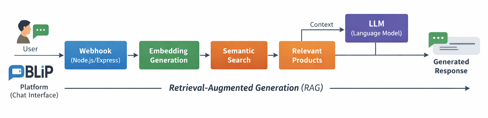

# AI Retail Chatbot (Node.js + RAG + Semantic Search + BLiP Integration)

An intelligent retail support chatbot built with Node.js, Express, semantic search, and embeddings.

The chatbot can be integrated with platforms such as **BLiP** through a webhook, allowing it to answer customer questions about products using natural language.

---

## ✨ Features

- **Semantic product search** using embeddings
- **Natural language responses** generated by an LLM
- Product catalog stored in a JSON dataset
- **Webhook integration** for chatbot platforms (BLiP)
- Simple and scalable Node.js + Express API
- **Retrieval-Augmented Generation (RAG)** architecture
- **Conversation memory** per user
- **Intent detection** for routing messages

## 💬 Example Conversation

```markdown
User:
Do you have a white men's t-shirt?

Bot:
Yes! We have a white cotton men's t-shirt available for $49.90.
```

---

## 🔄 Architecture

The chatbot uses a simplified RAG (Retrieval-Augmented Generation) pipeline:

1. The user sends a message
2. The message arrives at the webhook
3. The message is converted into an embedding
4. The system searches for the most relevant products
5. The relevant products are used as context
6. The LLM generates a natural response
7. The response is returned to the user



---

## 📁 Project Structure

```
blip-llm-webhook-bot/
│
├── data/
│   └── products.json
│
├── services/
│   └── productSearch.js
│
├── scripts/
│   └── generateEmbeddings.js
│
├── routes/
│   └── webhook.js
│
├── app.js
└── package.json
```

---

## 📦 Product Dataset

Products are stored in a JSON file.

**Example:**
```json
{
  "id": 1,
  "name": "White Men's T-Shirt",
  "price": 49.90,
  "description": "Basic cotton t-shirt"
}
```

> ⚠️ **Note**: Whenever new products are added, embeddings should be regenerated.

---

## 🚀 Installation

Clone the repository:
```bash
git clone https://github.com/Gustaavo-404/blip-llm-webhook-bot
```

Enter the project folder:
```bash
cd blip-llm-webhook-bot
```

Install dependencies:
```bash
npm install
```

---

## 🔐 Environment Variables

Create a `.env` file in the root directory:

```
PORT=3000
GITHUB_TOKEN=your_api_key_here
MODEL=your_llm_model_name_here
```

---

## 🧠 Generating Embeddings

Whenever the product dataset changes, run:

```bash
node scripts/generateEmbeddings.js
```

This generates the embeddings used for semantic search.

---

## ▶️ Running the Server

```bash
npm start
```

The server will start at:

```
http://localhost:3000
```

---

## 🌐 Webhook Endpoint

**POST** `/webhook`

**Example request:**
```json
{
  "from": "user123",
  "content": "Do you have a white men's t-shirt?"
}
```

**Example response:**
```json
{
  "reply": "Yes! We have a white cotton men's t-shirt available for $49.90."
}
```

---

## 🛠️ Technologies

- **Node.js** – Runtime environment
- **Express** – Web framework
- **Transformers.js** – Local embedding generation
- **Semantic Search** – Product relevance matching
- **RAG Architecture** – Context-aware responses
- **BLiP Chatbot Integration** – Platform connectivity

---

## 📈 Possible Improvements

- [ ] Vector database (Pinecone, Weaviate, Supabase)
- [ ] Product catalog connected to a real database
- [ ] Product recommendation system
- [ ] Multi-language support
- [ ] Analytics dashboard

---

## 👨‍💻 Author

**Gustavo Dev**  
Systems Analysis and Development – FATEC

---

> 📝 **Note**: This project is designed to be easily deployable and customizable for different retail scenarios.
